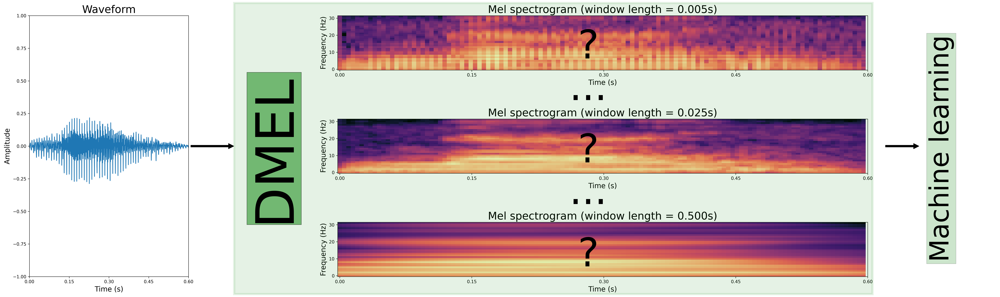

# DMEL: The differentiable log-Mel spectrogram as a trainable layer in neural networks

The official implementation of DMEL the method presented in the paper DMEL: The differentiable log-Mel spectrogram as a trainable layer in neural networks.

[Paper](https://johnmartinsson.org/publications/2024/differentiable-log-mel-spectrogram)

Cite as:
    
    @INPROCEEDINGS{Martinsson2024,
        author={Martinsson, John and Sandsten, Maria},
        booktitle={ICASSP 2024 - 2024 IEEE International Conference on Acoustics, Speech and Signal Processing (ICASSP)}, 
        title={DMEL: The Differentiable Log-Mel Spectrogram as a Trainable Layer in Neural Networks}, 
        year={2024},
        volume={},
        number={},
        pages={5005-5009},
        keywords={Neural networks;Transforms;Acoustics;Computational efficiency;Task analysis;Speech processing;Spectrogram;Deep learning;STFT;learnable Mel spectrogram;audio classification;adaptive transforms},
        doi={10.1109/ICASSP48485.2024.10446816}
    }
        
# Reproduce the results in the paper
    
## Install the environment
Requires python < 3.11
    
Using conda and pip (tested):
    
    conda create -n reproduce python==3.10
    conda activate reproduce
    conda install pip
    
    pip3 install -r requirements.txt
    
## Run everything in one script
Run the doit.sh script to download the audio data, run the experiments and produce the plots.

    sh doit.sh
    
which runs the commands

    # download the FSD dataset
    sh download_data.sh
    
    # run all the experiments (takes time ...)
    sh run_experiments.sh
    
    # run all test predictions
    sh run_test_predictions.sh
    
    # produce all the tables
    python produce_tables.py

The default number of runs are set to 1. Run once to check how long time it takes and that the results are reasonable, then increase the number of runs to 10 (set in run_experiments.sh) as in the paper.

# More details
Some details on how to use the code.

## Run experiments
An experiment is defined as a ray tune search space. The three search spaces presented in the paper are found in search_spaces.py, called esc50, audio_mnist and time_frequency. If you want to change the hyper parameter distribution simply modify the search space (e.g., https://docs.ray.io/en/latest/tune/api/search_space.html), or define another search space and update the appropriate line in main.py where the search space is loaded.

The experiments will not reproduce the exact results in the paper, the random seed has never been fixed, but the same trends should of the averages and standard deviations should be observed when re-running the experiments.

Run all the experiments.

    sh run_experiments.sh
    
The code uses 0.25 GPUs and 4 CPUs per experiment, edit the tune.with_resources line in main.py if you want to use more or less GPUs or CPUs. Defaults to cuda:0 device.

All search spaces has been defined using 'grid_search' in ray tune. This means that the command --num_samples will define the number of times each configuration in the grid is run. If this is re-written using e.g. 'uniform' or other sampling commands from the search space api (https://docs.ray.io/en/latest/tune/api/search_space.html), then --num_samples will define the number of samples from that distribution.
